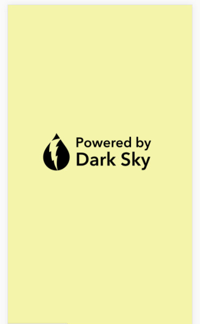
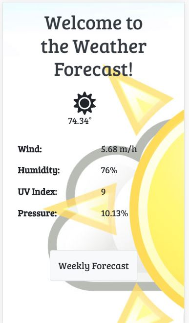

# API WEATHER: Dark Sky

### Trabajo Práctico sobre obtención de datos de una API.

* La API _**Dark Sky**_ maneja información sobre el clima.

* En la primera vista se nos dan los datos del clima según nuestra ubicación.

* En la segunda vista se está implementando la visualización del clima de la semana (7 días próximos).

* Vista del proyecto:

 

* En desarrollo por: Milagros Palma y Lucero Hospina.
